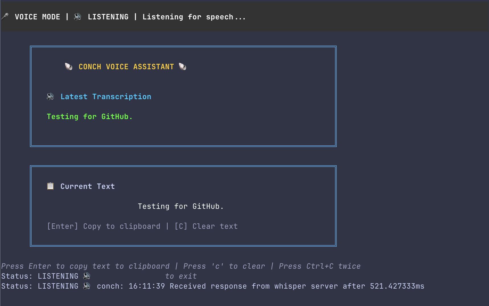

# Conch: Voice-Controlled Terminal Interface

Conch is a voice-controlled terminal interface that lets users seamlessly switch between typing and speaking to interact with their shell. The application uses SDL2 for real-time audio capture, whisper.cpp for accurate speech-to-text transcription, and Bubbletea for a responsive terminal UI.



## Building and Running

### Prerequisites

- Go 1.20 or higher
- SDL2 library installed on your system

### Build

```bash
# Clone the repository
git clone https://github.com/marcinja/conch.git
cd conch

# Build the project
go build -o conch cmd/conch/main.go
```

### Run

```bash
# Run Conch with your default shell
./conch

# Or specify a shell
SHELL=/bin/zsh ./conch
```

### Testing the Audio Capture

To test just the audio capture functionality:

```bash
# Build the audio test program
go build -o test_audio cmd/test_audio/main.go

# Run the test program
./test_audio
```

The test program will:
1. Listen for speech using your microphone
2. Show the current status (LISTENING, RECORDING, TRANSCRIBING)
3. Save detected speech to WAV files (recording_1.wav, recording_2.wav, etc.)
4. Display a placeholder transcription

#### Troubleshooting Audio Capture

If you don't see RECORDING status when speaking:
- Ensure your microphone is working and properly selected as the default input device
- Try speaking louder or closer to the microphone
- The voice activity detection has a threshold that might need adjustment for your microphone

#### Debug Mode

You can enable detailed debug output using the `DEBUG` environment variable:

```bash
# Enable audio capture debugging
DEBUG=capture ./test_audio

# Enable transcription debugging
DEBUG=transcribe ./test_audio

# Enable all debugging
DEBUG=all ./test_audio

# You can also combine modes
DEBUG=capture,transcribe ./test_audio
```

#### Working with the Recorded Audio

To convert the WAV files to MP3:
```bash
ffmpeg -i recording_1.wav recording_1.mp3
```

To play a recording:
```bash
# Using ffplay
ffplay recording_1.wav

# Or on macOS
afplay recording_1.wav
```

Press Ctrl+C to exit the test program. The application uses a graceful shutdown system to ensure all resources are properly released.

#### Testing the Whisper Integration

To test the Whisper transcription functionality:

```bash
# Run the JFK sample test (requires whisper.cpp samples)
go test -v github.com/marcinja/conch/pkg/speech -run TestWhisperTranscription

# Run the test with debugging enabled
DEBUG=transcribe go test -v github.com/marcinja/conch/pkg/speech -run TestWhisperTranscription
```

The test uses the JFK sample from the whisper.cpp repository to verify transcription accuracy.

#### Whisper Configuration

Conch uses whisper.cpp for speech recognition. By default, it looks for the whisper-server binary and model in specific locations, but you can customize these paths with environment variables:

```bash
# Override the path to the whisper-server binary
WHISPER_BIN=/path/to/your/whisper-server ./conch

# Override the path to the Whisper model file
WHISPER_MODEL=/path/to/your/model.bin ./conch

# You can set both at once
WHISPER_BIN=/custom/path/whisper-server WHISPER_MODEL=/custom/path/model.bin ./conch


```


## Core Components

  1. SpeechService
    - Handles audio capture via SDL2
    - Performs voice activity detection
    - Provides audio data for transcription
  2. WhisperServerService
    - Manages the Whisper.cpp server process
    - Handles audio-to-text conversion
    - Provides transcription results
  3. TerminalApp)
    - Main user interface using Bubbletea
    - Manages input modes (voice/manual)
    - Handles presentation of transcription results
  4. StatusService
    - Displays system status (listening/recording/transcribing)
    - Refactored to use io.Writer for flexible output


### Voice Detection with SDL2
```go
func startAudioCapture(audioChannel chan []int16) {
    // Initialize SDL2
    sdl.Init(sdl.INIT_AUDIO)
    defer sdl.Quit()
    
    // Configure audio capture
    spec := sdl.AudioSpec{
        Freq:     16000,
        Format:   sdl.AUDIO_S16,
        Channels: 1,
        Samples:  1024,
        Callback: sdl.AudioCallback(captureCallback),
    }
    
    // Open audio device and start capturing
    // ...
}
```

### Bubbletea Model Structure
```go
type model struct {
    pty           *os.File
    shellCmd      *exec.Cmd
    shellOutput   string
    inputPreview  string
    mode          int // 0=manual, 1=voice, 2=command
    isListening   bool
    isRecording   bool
    isTranscribing bool
    statusMessage string
    // ...
}
```


